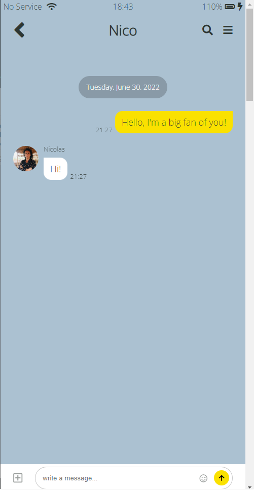

# Kokoa Clone 2020 Update

This is first project to study to make website. it is in use of only HTML,CSS
You can check the deployeed website in "https://nagneo.github.io/kokoa-clone/"

The follow is screeshots of website.

----------------------------------------------
## login

----------------------------------------------
## Friends

----------------------------------------------
## Chats

----------------------------------------------
## Chat

----------------------------------------------
## Find

----------------------------------------------
## More

----------------------------------------------
## Settings
